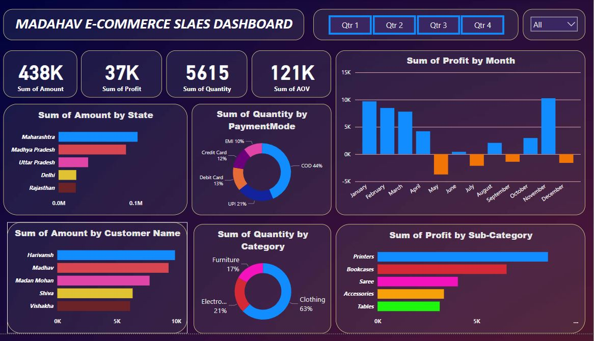

# **Project Key points:** #

## **Data collection** ##
- Data cleaning & wrangling
- Data modeling
- Data visualization
- Dashboard design
- Sharing insights
# **Problem statement/objective:**
The owner of Madhav Store wants us to analyze their online sales data across India and create an interactive dashboard using Power BI that will help them to grow their business in the future.

# **Dataset:**
- Orders.csv
- Order Details.csv
- background_img.jpg
# **Things I did:**
- Transformed data using Power Query (cleaning, formatting, performing aggregate functions, grouping, etc.)

- Performed ETL operations.
- Used DAX queries for calculating AOV (Average Order Value).
- Implemented important KPI's to visually represent and monitor our data, like sum of amount, sum of quantity, sum of profit & sum of AOV.
- Added slicers to check quarterly & state-wise data in one go.
- Visualized the entire data using donut-chart, stacked bar-chart, stacked column-chart, cards, and presented it in the dashboard.
# **Insights & recommendations:**
- Maharashtra, Madhya Pradesh, Delhi, Gujrat are the top 4 states that promote maximum sales and profit.
- People tend to do more shopping from the clothing category, followed by Electronics & Furniture category. Try to give exciting offers/discounts/coupons to grab customers' attention, and that will improve the sales of these categories as well.
- January, March, August, October, November have the highest number of profits. So, bring more seasonal collections, give 
  
- offers/coupons/discounts as needed.
- Harivansh, Madhav, Madan Mohan, Shiva, and Vishakha are some of the most frequent customers throughout the year that have contributed to the majority of the sales and profit generation. So, being such loyal customers for your store, reward them with gifts, discount-coupons, special offers, etc. This will bring other customers' attention towards your store.

- The most preferred Mode Of Payment is COD (cash on delivery), so try to avail this service on every product.

- Printer, bookcases, sarees are some of the sub-categories under electronics, furniture, clothing categories that have shown a good amount of profit.

- Quarter 1 & Quarter 4 gave us the best results.